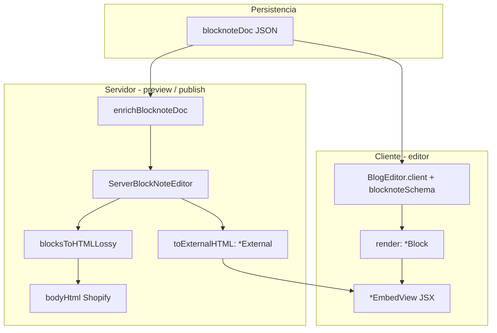

# Bloques personalizados en el blog editor

Guía del proyecto para añadir bloques BlockNote siguiendo el patrón de `productEmbed` y `collectionEmbed`. Complementa el índice genérico en [BlockNote.md](./BlockNote.md) y la documentación oficial de BlockNote.

## Principios

1. **Fuente de verdad:** el documento se guarda como **BlockNote JSON** (`blocknoteDoc` en PostgreSQL). El HTML solo se genera al previsualizar o publicar.
2. **Un solo markup:** el JSX vive en un componente `*View`; el editor y la exportación reutilizan ese mismo árbol.
3. **BlockNote exporta el HTML:** no escribir plantillas HTML a mano ni un `switch` por tipo de bloque. Usar `toExternalHTML` + `ServerBlockNoteEditor.blocksToHTMLLossy`.
4. **Datos externos (Shopify):** BlockNote no hace fetch. La app guarda props cacheadas al insertar y las refresca en servidor antes de exportar (`enrich-embeds.server.js`).



## Estructura de archivos

| Archivo | Responsabilidad |
|---------|-----------------|
| `app/components/editor/blocks/{Name}EmbedView.jsx` | Markup Bulma (`b-*`), `propsFromBlock`, props planas de vista |
| `app/components/editor/blocks/{Name}EmbedBlock.jsx` | `render` + `toExternalHTML` (adaptadores finos) |
| `app/lib/blocknote/schema.js` | `createReactBlockSpec` + registro en `blocknoteSchema` |
| `app/lib/blocknote/enrich-embeds.server.js` | Refresco de props desde Shopify antes del export |
| `app/lib/blocknote/export-html.server.js` | `enrichBlocknoteDoc` → `blocksToHTMLLossy` (no tocar salvo cambio global) |
| `app/lib/blocknote/server-editor.server.js` | Singleton `ServerBlockNoteEditor` con el mismo schema |
| `app/lib/blocknote/custom-block-catalog.js` | Catálogo de bloques embebidos (sidebar + slash) |
| `app/lib/blocknote/slash-menu-items.jsx` | Menú `/` derivado del catálogo |
| `app/components/editor/CustomBlocksSidebar.jsx` | Panel izquierdo: catálogo + picker de búsqueda |
| `app/components/editor/ArticleEditorShell.client.jsx` | Layout sidebar + editor; `insertFromPicker`, búsqueda (`useFetcher`) |
| `app/components/editor/BlogEditor.client.jsx` | BlockNote + `insertEmbedBlock` (solo cliente) |
| `app/routes/app.articles.$id.jsx` | Monta `ArticleEditorShell` en pestaña Editar |
| `app/styles/article-editor-layout.css` | Grid sidebar + área de edición |

Referencias de implementación:

- Producto (tarjeta): [`ProductEmbedView.jsx`](../app/components/editor/blocks/ProductEmbedView.jsx), [`ProductEmbedBlock.jsx`](../app/components/editor/blocks/ProductEmbedBlock.jsx)
- Producto horizontal (fila): [`ProductHorizontalView.jsx`](../app/components/editor/blocks/ProductHorizontalView.jsx), [`ProductHorizontalBlock.jsx`](../app/components/editor/blocks/ProductHorizontalBlock.jsx) — mismo `searchIntent` (`searchProducts`) y distinto `type` en schema (`productHorizontal`)
- Colección: [`CollectionEmbedView.jsx`](../app/components/editor/blocks/CollectionEmbedView.jsx), [`CollectionEmbedBlock.jsx`](../app/components/editor/blocks/CollectionEmbedBlock.jsx)

## Checklist: nuevo bloque embebido

Sustituye `Foo` / `fooEmbed` por el nombre del bloque (camelCase en `type`, PascalCase en componentes).

### 1. Vista presentacional (`FooEmbedView.jsx`)

- Exportar `propsFromBlock(block)` — mapea `block.props` del schema a props planas de UI.
- Exportar `FooEmbedView({ layout, gid, title, ... contentEditable })` — solo JSX y clases Bulma.
- Usar prefijo **`b-`** en todas las clases (`b-card`, `b-columns`, `b-title`, …). El theme compila Bulma con `$class-prefix: "b-"` en [`src/bulma/sass/utilities/initial-variables.scss`](../src/bulma/sass/utilities/initial-variables.scss).
- Añadir un atributo `data-*-gid` estable para identificar el recurso en HTML publicado.
- En bloques sin texto editable: `contentEditable={false}` solo cuando `render` pase `contentEditable={false}`; **no** pasarlo en `toExternalHTML`.
- **No** usar hooks que dependan de React Context en la vista (BlockNote serializa `toExternalHTML` en otra raíz).

### 2. Adaptadores BlockNote (`FooEmbedBlock.jsx`)

```jsx
import { FooEmbedView, propsFromBlock } from "./FooEmbedView";

export function FooEmbedBlock({ block }) {
  return <FooEmbedView {...propsFromBlock(block)} contentEditable={false} />;
}

export function FooEmbedExternal({ block }) {
  return <FooEmbedView {...propsFromBlock(block)} />;
}
```

- `render` → experiencia en el editor.
- `toExternalHTML` → HTML al exportar, copiar al portapapeles, y `blocksToHTMLLossy` en servidor.

### 3. Registrar en el schema (`schema.js`)

```js
const fooEmbed = createReactBlockSpec(
  {
    type: "fooEmbed",
    propSchema: {
      fooGid: { default: "" },
      layout: { default: "card", values: ["card", "row"] },
      fooTitle: { default: "" },
      // …todas las props que la vista necesite, con default ""
    },
    content: "none",
  },
  {
    render: FooEmbedBlock,
    toExternalHTML: FooEmbedExternal,
  },
);

export const blocknoteSchema = BlockNoteSchema.create({
  blockSpecs: {
    ...defaultBlockSpecs,
    productEmbed: productEmbed(),
    collectionEmbed: collectionEmbed(),
    fooEmbed: fooEmbed(),
  },
});
```

Reglas del `propSchema`:

- Solo tipos primitivos que BlockNote serialice bien (`string`, `boolean`, `number`).
- `values` opcional para enums (`layout`, etc.).
- Guardar en props **todo** lo necesario para pintar sin API: título, imagen, handle, etiquetas derivadas (p. ej. precio formateado).

### 4. Enriquecimiento en servidor (`enrich-embeds.server.js`)

Añadir `enrichFooEmbedProps(admin, props)` y un `case` en `enrichBlock`:

```js
async function enrichFooEmbedProps(admin, props) {
  const gid = props.fooGid;
  if (!gid) return props;
  try {
    const foo = await getFoo(admin, String(gid));
    if (!foo) return props;
    return {
      ...props,
      fooTitle: foo.title || props.fooTitle || "Foo",
      // …mapear campos de la API
    };
  } catch {
    return { ...props, fooTitle: props.fooTitle || "Foo", /* fallbacks */ };
  }
}

// En enrichBlock:
if (type === "fooEmbed") {
  enrichedProps = await enrichFooEmbedProps(admin, props);
}
```

- **Clonar** bloques (como hace `enrichBlock`); no mutar el `blocknoteDoc` del draft en memoria del cliente.
- Si la API falla, usar props cacheadas del documento.

Implementar la query en [`app/lib/shopify/catalog.server.js`](../app/lib/shopify/catalog.server.js) si aún no existe.

### 5. Insertar desde la UI

**Props al insertar** — en `insertFromPicker` dentro de [`ArticleEditorShell.client.jsx`](../app/components/editor/ArticleEditorShell.client.jsx):

```js
insertEmbedBlock(editor, "foo", {
  fooGid: item.id,
  fooTitle: item.title,
  // …mismos campos que el propSchema
  layout: "card",
});
```

`insertEmbedBlock` en [`BlogEditor.client.jsx`](../app/components/editor/BlogEditor.client.jsx) mapea `kind` → `type` (`product` → `productEmbed`). Para un nuevo kind, extender ese helper, el catálogo y la rama correspondiente en `insertFromPicker` del shell (o llamar `editor.insertBlocks` con `type: "fooEmbed"` directamente).

**Catálogo** — añadir entrada en [`custom-block-catalog.js`](../app/lib/blocknote/custom-block-catalog.js) (`kind`, `searchIntent`, iconos). La sidebar y el menú `/` se actualizan solos.

**Menú slash** — [`slash-menu-items.jsx`](../app/lib/blocknote/slash-menu-items.jsx) mapea el catálogo; no hace falta duplicar ítems a mano.

**Picker / búsqueda** — action en la route del artículo (`searchFoos`) que devuelva resultados GraphQL; extender `insertFromPicker` y `getSearchIntentForKind` en el shell. Reutilizar el patrón de `searchProducts` / `searchCollections`.

### 6. No hace falta tocar (salvo cambios globales)

- [`export-html.server.js`](../app/lib/blocknote/export-html.server.js) — ya enriquece y llama a `blocksToHTMLLossy`.
- [`server-editor.server.js`](../app/lib/blocknote/server-editor.server.js) — usa `blocknoteSchema`; nuevos bloques entran solos al ampliar el schema.

## Estilos y HTML publicado

- El editor y la vista previa cargan Bulma vía [`app/styles/theme-preview.scss`](../app/styles/theme-preview.scss).
- El HTML en Shopify **no incluye** `<link>`; el storefront del theme debe tener las mismas clases `b-*`.
- Clase de contenedor semántica en el embed: `product-embed`, `product-horizontal-embed`, `collection-embed` — usar `{name}-embed` para CSS específico en theme.

## Bloques sin datos de Shopify

Para bloques estáticos (callout, banner, CTA):

1. Igual: `*View` + `*Block` + `*External` + `schema.js`.
2. Omitir paso en `enrich-embeds.server.js`.
3. `content: "inline"` solo si el usuario debe escribir texto dentro del bloque; entonces usar `contentRef` según [Custom Blocks](https://www.blocknotejs.org/docs/features/custom-schemas/custom-blocks).

## Editor solo en cliente (SSR)

BlockNote y ProseMirror **no deben cargarse en el SSR** de las rutas. El editor vive en [`BlogEditor.client.jsx`](../app/components/editor/BlogEditor.client.jsx) (convención React Router 7: sufijo `.client`).

- Importar siempre desde rutas así: `import { BlogEditor } from "../components/editor/BlogEditor.client"`.
- No renombrar a `.jsx` sin `.client`: provoca `Duplicate use of selection JSON ID multiple-node` al empaquetar dos copias de `prosemirror-state` en el servidor.
- La exportación HTML en actions usa [`export-html.server.js`](../app/lib/blocknote/export-html.server.js) + `ServerBlockNoteEditor`, no `BlogEditor`.

En [`vite.config.js`](../vite.config.js), `ssr.noExternal` incluye solo `@blocknote/server-util`; `ssr.resolve.dedupe` lista los paquetes `prosemirror-*`.

## Errores habituales

| Evitar | Hacer en su lugar |
|--------|-------------------|
| Importar `BlogEditor` sin `.client` en rutas | `BlogEditor.client.jsx` |
| `templates/foo.js` con strings HTML | `FooEmbedView` + `toExternalHTML` |
| Duplicar markup en `render` y export | Un solo `*View` |
| `switch (block.type)` en export para HTML | `blocksToHTMLLossy` |
| Clases sin prefijo `card`, `columns` | `b-card`, `b-columns` |
| Confiar solo en fetch al publicar | Guardar props al insertar + enrich al exportar |
| Hooks de tema/context en `*View` | Props planas; si hiciera falta contexto, `withReactContext` en servidor (raro aquí) |

## Verificación

1. Insertar bloque en el editor — se ve con Bulma (`b-*`), datos del picker.
2. Guardar y recargar — props persisten en JSON.
3. **Vista previa** — HTML con `data-*-gid` y clases correctas.
4. **Publicar** — mismo HTML en `Article.body` de Shopify.
5. Copiar el bloque en el editor — markup coherente (usa `toExternalHTML`).
6. Artículo antiguo con props mínimas — export con fallbacks tras enrich.

## Documentación BlockNote (externa)

- [Custom Blocks](https://www.blocknotejs.org/docs/features/custom-schemas/custom-blocks) — `render`, `toExternalHTML`, `propSchema`
- [Server-side processing](https://www.blocknotejs.org/docs/features/server-processing) — `ServerBlockNoteEditor`
- [HTML export](https://www.blocknotejs.org/docs/features/export/html) — `blocksToHTMLLossy` vs `blocksToFullHTML`
- [Document structure](https://www.blocknotejs.org/docs/foundations/document-structure) — forma del JSON

Índice local de enlaces: [BlockNote.md](./BlockNote.md).
